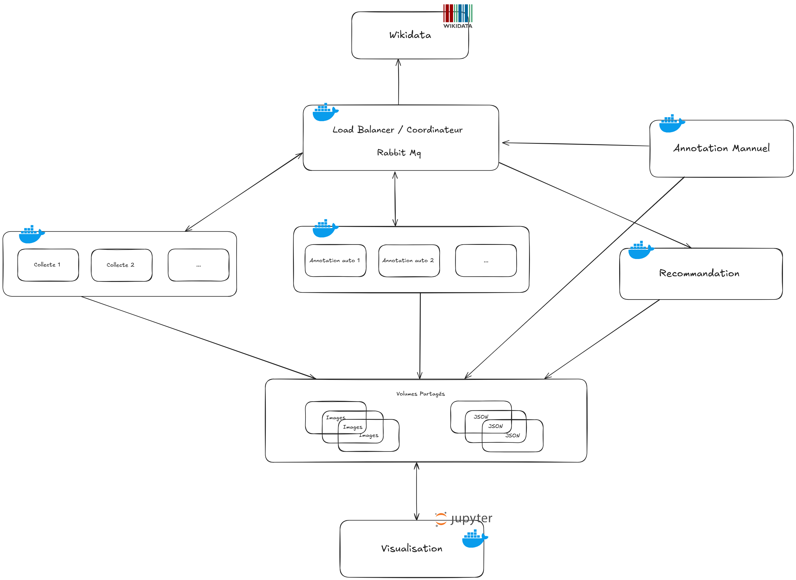

## Architecture : 



## Utilisation : 
### 1. Lancement initial

Démarrez le projet avec plusieurs conteneurs `collecteur` et `annoteur` (exemple : 2 de chaque) :

```bash
docker-compose up --scale collecteur=2 --scale annoteur=2
```
Ces services tourneront en continu pour traiter les images automatiquement.

### 2. Attente de fin de traitement
Laisse les collecteurs et annoteurs travailler. Une fois que RabbitMQ ne contient plus de messages "ready", tu peux passer à la suite.

### 3. Annotation manuelle
Lance l’interface web manuelle :
- Depuis le navigateur, accède à http://localhost:5000 pour corriger ou ajouter des tags aux images.

Une fois les tags soumis, le service de recommandation se déclenche automatiquement.

### 4. Visualisation
Tu peux maintenant visualiser les recommandations dans le notebook :
rends-toi sur http://localhost:8888 et ouvre le fichier recommandation.ipynb pour consulter les résultats.
